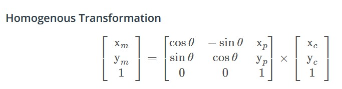
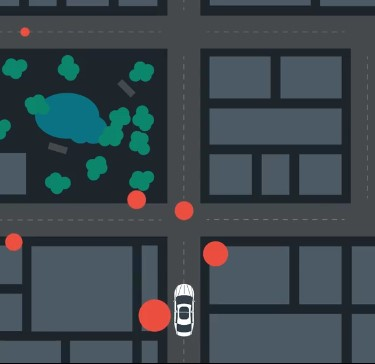
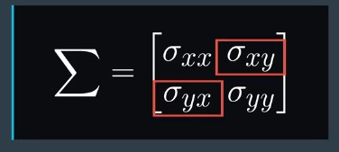

# Particle Filters in C++

You know what particle filter is and how it works. In this lesson, you learn some important implementation details. Afterwards you will be able to understand how to implement a particle filter in the context of C++.

## Pseudocode

To implement a particle filter we start with the flowchart (see below), which represent the steps of the particle filter algorithm as well as its inputs.

  
 

Psuedo Code

This is an outline of steps you will need to take with the code in order to implement a particle filter for localizing an autonomous vehicle. The pseudo code steps correspond to the steps in the algorithm flow chart (see figure above), initialization, prediction, particle weight updates, and resampling. Python implementation of these steps was covered in this [repository](https://github.com/A2Amir/Particle-Filters).
 
1. At the initialization step (see above) we estimate our position from GPS input. The subsequent steps in the process will refine this estimate to localize our vehicle.

 
  
 

2. During the prediction step we add the control input (yaw rate & velocity) for all particles
 
 
  
 

3. During the update step, we update our particle weights using map landmark positions and feature measurements.
 
 
  
 

4. During resampling we will resample M times (M is range of 0 to length_of_particleArray) drawing a particle i (i is the particle index) proportional to its weight. one implementation of this is covered in this [repository](https://github.com/A2Amir/Particle-Filters).

 
  
 

 
5. The new set of particles represents the Bayes filter posterior probability. We now have a refined estimate of the vehicles position based on input evidence.

 
  
 

## 1. Initialization

The first thing you need to do to implement a particle filter is initialize all your particles. You have to decide how many particles you want to use. This parameter is mostly decided empirically but theoretically, the particle filter will exactly represent the Bayesian posterior distribution as the number of particles approaches infinity. If you have too few particles, you will not have enough to cover all of the high likelihood positions, so you might miss the correct position.
For instance, if each cell in the below presented  grid is equally likely to be the car’s position, and you only have three particles.
 
 
  
 

you would not have enough particles right now to represent this However, having too many particles will slow down your filter, and prevent it from localizing a self-driving car in real time.

There are two main ways you can initialize your particles:
* The first approach is to sample uniformly across the state space. For instance, you could divide the state space into a grid and put one particle in each cell. However, this approach is not very practical if the state space is too large, such as in the case of a self-driving car, where the state space spans essentially the entire land surface of the earth.

  
  
 

* The second approach for initialization is to sample around some kind of initial estimate.For a self-driving car, this initial estimate can come from a global positioning system, or GPS but you cannot rely on GPS alone for localization, because of its low accuracy and reduced availability in certain environments.

   
  
 

However, GPS can be very useful to provide initial rough estimate of your location.

### 1.1 Implementation of Initialization

The most practical way to initialize our particles and generate real time output, is to make an initial estimate using GPS input. As with all sensor based operations, this step is impacted by noise.

* Particles shall be implemented by sampling a Gaussian distribution, taking into account Gaussian sensor noise around the initial GPS position and heading estimates.

* Use the [C++ standard library normal distribution](https://en.cppreference.com/w/cpp/numeric/random/normal_distribution) and [C++ standard library random engine](http://www.cplusplus.com/reference/random/default_random_engine/) functions to sample positions around GPS measurements.

A function called ‘‘[printSamples](https://github.com/A2Amir/Implement-a-particle-filter-in-the-context-of-Cplus/blob/master/C%2B%2B%20code/printSamples.cpp)’’, which is based on the above criteria, that takes a GPS position (gps_x, gps_y) and an initial heading (theta) as input. The function prints out to the terminal 3 samples from a normal distribution with mean equal to the GPS position and initial heading measurements and standard deviation of 2 m for the x and y position and 0.05 radians for the heading of the car.

~~~c++
#include "iostream"
#include <random>
using std::normal_distribution;
void printSimples(double gps_x,double gps_y,double theta);
 int main(int argc, char const *argv[]) {
     double gps_x=4983;
     double gps_y=5029;
     double theta = 1.201;

     printSimples(gps_x,gps_y,theta);

     return 0;
 }
 void printSimples(double gps_x, double gps_y, double theta)
 {
     std::default_random_engine gen;
      //Set standard deviations for x, y, and theta
      double std_x = 2;
      double std_y = 2;
      double std_theta = 0.05;
        //  Create normal distributions for x, y and theta
     normal_distribution<double> dist_x(gps_x,std_x);
     normal_distribution<double> dist_y(gps_y,std_y);
     normal_distribution<double> dist_theta(theta,std_theta);

     for (int i = 0; i < 3; ++i)
     {
         double sample_x=dist_x(gen);
         double sample_y=dist_y(gen);
         double sample_theta=dist_theta(gen);
         // Print your samples to the terminal.
         std::cout << "Sample " << i + 1 << " " << sample_x << " " << sample_y << " "
          << sample_theta << std::endl;
      }

 }
~~~
Result:

Sample 1 4982.76 5030.37 1.20266, 
Sample 2 4980.83 5026.85 1.23824,
Sample 3 4983.07 5029.93 1.30723,

## 2. Prediction Step

The next part of the filter needs to implement is the prediction step. For the prediction step, we will use what you learned in the [motion models lesson](https://github.com/A2Amir/Motion-Model-of-a-Car) to predict where the car will be at the next time step.

  
 

 
For each particle, we will have to update the particle’s location based on velocity and yaw rate measurements. To account for the uncertainty in the control input, in the project we will also add Gaussian noise to the velocity and yaw rate.
The equations for updating x, y and the yaw angle when the yaw rate is not equal to zero:
 

  
 

If you want to practice calculating the prediction of a car’s position, assuming a basic motion model and disregarding sensor uncertainty, you can check this [jupyter notebook](https://github.com/A2Amir/Implement-a-particle-filter-in-the-context-of-Cplus/blob/master/Practice.ipynb).

## 3. Update Step

In the next few concepts, we will walk through critical step (Update) which consists of the tree steps   for localizing our car by implementing a particle filter. Our ultimate goal is determine how well each of our particle positions represents the actual position of our car. To do this, we must use car sensor and map inputs to weigh each particle.

  
 

As you see above we will walk through this process for a single particle by:

* Transforming car sensor landmark observations from the car coordinate system to the map coordinate system (Transform step)
* Associating these transformed observations with the nearest landmark on the map (Associate step). 
* Updating our particle weight by applying the multivariate Gaussian probability density function for each measurement (Determine measurement probabilities step),
* Combining the probabilities of all the measurements by taking their product (Combine Probabilities step).

This final weight is our posterior probability.

### 3.1 Transform
In this section we will go over the first step, transforming observations to map coordinates. 

  
 

In the graph above we have a car **(ground truth position)** that observes three nearby landmarks, each one labeled **OBS1, OBS2, OBS3**. Each observation measurement has x, and y values in the car's coordinate system. We have a particle **"P" (estimated position of the car)** above with position (4,5) on the map with heading -90 degrees. The first task is to transform each observation measurement from the vehicle's coordinates to the map's coordinates, with respect to our particle.

Remember that by convention, we define the car’s coordinates such as X is pointed in the direction of the vehicle’s heading with y rotated plus 90 degrees or to the left perpendicular as above.

We can achieve this transformation (the vehicle's coordinates to the map's coordinates) by passing our data through **a trigonometric function** that maps car coordinates to map coordinates. This function is called a homogeneous transformation and is composed of a rotation in a translation.

As see bellow, we first have to rotate the map by negative 90 degrees to match the particles point of view **(Step 1)**. Then we will move the origin of the rotated map to the location of the particle **(Step 2)**. We can do both of these steps process in one matrix multiplication using the homogeneous transformation. We know that our particle has a heading of negative 90 degrees and a map location (4,5). 

  
 

Observations in the car coordinate system can be transformed into map coordinates (xm and ym) by passing car observation coordinates (xc and yc ), map particle coordinates (xp  and yp ), and our rotation angle (-90 degrees) through a homogenous transformation matrix. This homogenous transformation matrix, shown below, performs rotation and translation.

  
 

[Matrix multiplication](https://www.mathsisfun.com/algebra/matrix-multiplying.html) results in:

  
 

To summarize:
* This homogeneous transformation is a transformation from car coordinates to map coordinates in the maps frame.
* Using our observations in the car coordinate system and our particle pose in the map system, we have everything we need to transform observations into map coordinates and ultimately determine the final weight of our particle
* This [video](https://www.youtube.com/watch?v=h11ljFJeaLo&feature=youtu.be) is a great resource for developing a deeper understanding of how to solve this transformation problem.
* Here are some example in the context of [python](https://github.com/A2Amir/Implement-a-particle-filter-in-the-context-of-Cplus/blob/master/Practice.ipynb) and [C++](https://github.com/A2Amir/Implement-a-particle-filter-in-the-context-of-Cplus/blob/master/C%2B%2B%20code/ConvertingLandmarkObservations.cpp) code to get better intuition.

### 3.2 Association

#### Data Association problom: Nearest Neighbor

Before we can use landmark measurements of the objects around us to update the belief of our position, we have to solve the data association problem. Data association is the problem of matching landmark measurements (feature measurement) to objects in the real world (map landmarks).

  
 

Let’s look at an example below to show why data association is important. We can assume that we are confident that we have two lidar sensor measurements (blue and red line in the gif).Which of these two measurements corresponds to the rock? If we pick the top measurement, then we will estimate that the true position of the car is actually here (see gif). If we pick the bottom measurement then we will estimate that the true position of the car is here(see gif).  how do we pick the right measurement?

  
 

For the self-driving car, you might have a map with landmarks, shown in blue, and lidar measurements, shown in orange. Oftentimes, you have some map landmarks that have multiple lidar measurements that could correspond to it (see below figure).

  
 

To pick the right correspondents, we can use a very simple technique called nearest neighbor. In this method, simply take the closest measurement as the correct correspondents, like the circled map landmark and lidar measurement.

  
 

**Notice: Nearest neighbor data association has some advantage that should be taken into consideration.**
 
 
  
 

**High signal to noise ratio for sensors and a very accurate motion model are characteristics of the input data that help nearest neighbor data association becomes more effective. Next you will learn about practicing Association.**

#### Practicing Association 

Now that observations have been transformed into the map's coordinate space, the next step is to associate each transformed observation with a landmark identifier. In the map below we have 5 total landmarks each identified as L1, L2, L3, L4, L5, and each with a known map location.
We need to associate each transformed observation(from [example in python](https://github.com/A2Amir/Implement-a-particle-filter-in-the-context-of-Cplus/blob/master/Practice.ipynb)) TOBS1 (6,3), TOBS2(2,2), TOBS3(0,5)  with one of these 5 identifiers. To do this we must associate the closest landmark to each transformed observation.

 
  
 

By looking at the distances of each transformed Obseravation(TOBS1 to 3) to each of the 5 landmarks, we can understand for:

* TOBS1(6,3) associated with L1 (5,3)
* TOBS2 (2,2) associated with L2 (2,1)
* TOBS3(0,5)   associated with L5 (4,7) (TOBS3 can be associated with either L2, or L5, since they are the same distance apart)

### 3.3 Update Weights

You have learned in the prediction step how to incorporate velocity and yaw rate measurements into the particle filter. But what about sensor measurements, such as readings from radar or lidar? Or how to update particle weights based on LIDAR and RADAR readings of landmarks. These landmark measurements (feature measurement) will be used to compute the update step, which you saw before in the Bayesian filter.

 
  
 
 
 Instead of the feature measurements directly affecting the prediction of the state of the car, the measurements will instead inform the weight of each particle. The size of each particle in the below visualization correlates with its weight.
 
 
 
  
 

One way to update the weights of the particles is to use the multivariate Gaussian probability density function for each measurement and combine the likelihoods of all the measurements by taking their product. 
The multivariate Gaussian function(shown below) tells us how likely a set of landmark measurements is, given our predicted state of the car and the assumption that the sensors have Gaussian noise. We also assume each landmark measurement is independent, so we will take the product of the likelihoods over all measurements.

 
  
 

* xi represents the ith landmark measurement for one particular particle.
* mui  represents the predicted measurement for the map landmark corresponding to the ith measurement.
* m is the total number of measurements for one particle.
* sigma is the covariance of the measurement.

The covariance matrix (sigma) is a symmetric square matrix that contains the variance, or uncertainty of each variable in the sensor measurement, as well as the covariance, or correlation, between these variables.

 
  
 

In the case of lidar, the variables would be the x and y position of the landmark and vehicle coordinates. The diagonal terms of the covariance matrix, which is the standard deviation of the variable squared.

Below, the orange ovals around each lidar measurement are geometric representations of some covariance matrices. Notice how the covariance changes as you change the diagonal terms. As the x variance term increases, the uncertainty in the x direction also increases.
 
  
 
 
Similarly, as the y variance term increases (above), the uncertainty in the y direction also increases. You can think of the covariance matrix as an inverse matrix of weights. The smaller the diagonal term for a certain variable, the more you can trust this variable in the measurement and the higher the weight we can put on it.

The off diagonal terms of the covariance matrix represent the correlation between the two variables.
For instance, if x increases as y increases, For the project, we will assume the different variables in the sensor measurement are independent, and therefore the off diagonal terms are 0. However, this is often not the case in practice.

 
  
 
 
 Now we have done the measurement transformations and associations, we have all the pieces we need to calculate the particle's final weight. The particles final weight will be calculated as the product of each measurement's Multivariate-Gaussian probability density.
The Multivariate-Gaussian probability density has two dimensions, x and y. The mean of the Multivariate-Gaussian is the measurement's associated landmark position and the Multivariate-Gaussian's standard deviation is described by our initial uncertainty in the x and y ranges. The Multivariate-Gaussian is evaluated at the point of the transformed measurement's position. The formula for the Multivariate-Gaussian can be seen below.

 
  
 
 
 

